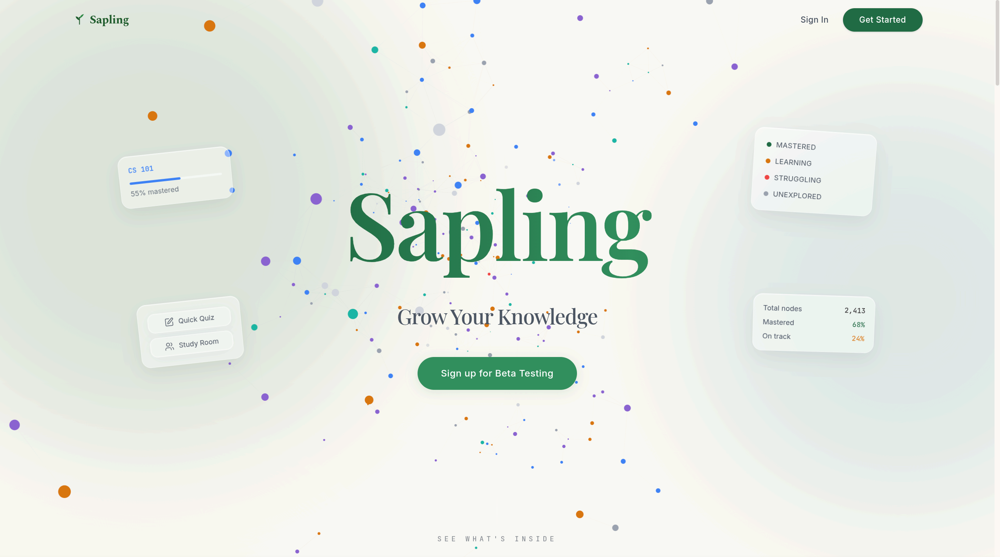

# Sapling

An AI-powered study companion that builds a live knowledge graph as you learn.




## Overview

Sapling is a study tool that adapts to how you learn. Chat with an AI tutor across three teaching modes, take adaptive quizzes, track assignments from your syllabus, and compare progress with classmates in study rooms. As you learn, a live knowledge graph maps your mastery in real time.

## Features

* **Live Knowledge Graph** — Your understanding is visualized as a growing node graph. Mastery scores update dynamically after every session and quiz, with per-course color shading and mastery-based opacity.
* **Three Teaching Modes** — Socratic (guided reasoning), Expository (direct explanation), and TeachBack (you explain, Sapling corrects). Chat supports inline math (KaTeX), Mermaid diagrams, function plots, and theorem callouts.
* **Adaptive Quizzes** — AI-generated quizzes targeting your weakest concepts, with difficulty scaling based on your performance.
* **Flashcards** — Generate AI flashcards per course, or import them from paste, file (CSV/Markdown/Anki), URL, AI prompt, or photo. Study by topic with spaced-repetition ratings (Easy / Hard / Forgot).
* **Gradebook** — Track your real-world grade per course. Categories + weights, per-assignment scores, per-course letter-scale overrides, and current grade calculation. Upload a syllabus and Sapling extracts categories and assignments automatically.
* **Study Guide** — Generate a Gemini-powered exam study guide from your uploaded course materials. Guides are cached per exam and can be regenerated at any time.
* **Class Intelligence** — Aggregates anonymized class-wide patterns to surface common misconceptions and weak areas, personalizing your sessions.
* **Calendar & Syllabus Tracking** — Paste your syllabus and Sapling extracts assignments, deadlines, and topics automatically.
* **Document Library** — Upload PDFs and notes (up to 100 MB each); Sapling extracts summaries, key concept notes, and flashcard topics to enrich your knowledge graph and study guides. Uploads use a streaming SSE pipeline so the UI shows live per-phase progress (*"Classifying..." → "Extracting summary, concepts, and syllabus..." → "Saved."*). Concept notes can be re-scanned manually per doc or per course.
* **Study Rooms** — Invite classmates, compare knowledge graphs, and track relative mastery across your group.
* **Room Chat** — Real-time text chat with avatars inside each study room.
* **User Profiles** — Public profiles with academic info, bio, featured achievements, and equipped cosmetics.
* **Achievements & Cosmetics** — Unlock achievements by hitting milestones (sessions, quizzes, streaks). Equip cosmetic rewards like avatar frames, name colors, and title flairs.
* **Roles & Admin Panel** — Role-based access control with an admin panel for user approval, role assignment, and content management.
* **Onboarding Flow** — Multi-step onboarding that collects school, major, year, and courses after first sign-in. Sign-in itself is a popup-based Google OAuth flow launched from the landing page.
* **Newsletter** — Beta-list signup directly from the landing page.
* **Feedback & Issue Reporting** — Submit session feedback or report bugs directly from the app.

## Tech Stack

* **Frontend** — Next.js 16 (TypeScript, App Router) with D3.js for interactive graph visualization. Vitest with jsdom + React Testing Library for unit + component tests.
* **Backend** — FastAPI (Python) serving a REST API. Document ingestion runs through a Pydantic AI agentic pipeline (4 typed worker agents fanned out in parallel via `asyncio.gather`); other LLM-driven routes still use the structured-prompt helper in `services/gemini_service.py` until they're migrated.
* **AI** — Google Gemini, with per-task model routing configurable via env vars. Defaults: `gemini-2.5-flash-lite` for classifier + summary; `gemini-2.5-flash` for concept extraction + syllabus parsing; `gemini-2.5-flash-lite` for quiz generation and concept suggestions. Override per task via `SAPLING_MODEL_<TASK>`.
* **Streaming** — `sse-starlette` Server-Sent Events on `POST /api/documents/upload` for live per-phase progress. The frontend SSE consumer (`frontend/src/lib/sse.ts`) parses the wire format from a fetch ReadableStream so it works with multipart POSTs (which `EventSource` can't do).
* **Observability** — [Logfire](https://logfire.pydantic.dev) auto-instruments Pydantic AI agent runs, tool calls, and FastAPI requests. A custom span scrubber (`backend/services/logfire_scrubber.py`) truncates and SHA-256-fingerprints risky attribute paths (prompt text, model output, message content) before egress so user-uploaded document text never ships verbatim. `genai-prices` provides per-call cost telemetry. Per-request structured logging includes a correlation ID, status, and duration.
* **OCR** — Docling (layout-aware PDF → Markdown) with GOT-OCR 2.0 fallback for math/handwriting; Tesseract retained as a legacy fallback.
* **Database** — Supabase (PostgreSQL) for all persistent data
* **Encryption** — AES-256-GCM column-level encryption (via the `cryptography` library) for user PII, document summaries/concept notes, OAuth tokens, chat messages, and gradebook notes
* **Deploy** — Frontend on Cloudflare Workers via `@opennextjs/cloudflare`

## Usage

**Backend**
```bash
cd backend
python3 -m venv venv
source venv/bin/activate   # fish: source venv/bin/activate.fish
pip install -r requirements.txt
cp .env.example .env       # fill in GEMINI_API_KEY, SUPABASE_URL, SUPABASE_SERVICE_KEY, ENCRYPTION_KEY
python3 main.py            # → http://localhost:5000
```

**Frontend**
```bash
cd frontend
npm install
echo "NEXT_PUBLIC_API_URL=http://localhost:5000" > .env.local
npm run dev                # → http://localhost:3000
```

## API Endpoints

**Learn**
- `POST` `/api/learn/start-session` — Start a tutoring session
- `POST` `/api/learn/chat` — Send a chat message
- `POST` `/api/learn/action` — Send a structured action (e.g. quiz, recap)
- `POST` `/api/learn/end-session` — End a session
- `GET`  `/api/learn/sessions/{user_id}` — List past sessions

**Graph**
- `GET`  `/api/graph/{user_id}` — Fetch the user's knowledge graph
- `GET`  `/api/graph/{user_id}/recommendations` — Get next-concept recommendations
- `GET`  `/api/graph/{user_id}/courses` — List courses

**Quiz**
- `POST` `/api/quiz/generate` — Generate an adaptive quiz
- `POST` `/api/quiz/submit` — Submit answers and update mastery

**Flashcards**
- `POST` `/api/flashcards/generate` — Generate flashcards for a topic
- `POST` `/api/flashcards/import/parse` — Parse cards from paste, file, URL, or photo (no save)
- `POST` `/api/flashcards/import/generate` — AI-generate cards from a topic / prompt
- `POST` `/api/flashcards/import/cleanup` — Clean up parsed cards before commit
- `POST` `/api/flashcards/import/cloze` — Convert sentences into cloze-deletion cards
- `POST` `/api/flashcards/import/commit` — Commit parsed cards to the user's deck
- `GET`  `/api/flashcards/user/{user_id}` — Fetch a user's flashcards
- `POST` `/api/flashcards/rate` — Rate a card (Easy / Hard / Forgot)
- `DELETE` `/api/flashcards/{card_id}` — Delete a card

**Gradebook**
- `GET`   `/api/gradebook/summary` — Per-course grade summary across the user's courses (filter by `semester`)
- `GET`   `/api/gradebook/courses/{course_id}` — Full gradebook for a course (categories, assignments, current grade)
- `POST`  `/api/gradebook/courses/{course_id}/categories` — Create a category
- `PATCH` `/api/gradebook/courses/{course_id}/categories` — Bulk-update categories (weights, names)
- `DELETE` `/api/gradebook/categories/{category_id}` — Delete a category
- `POST`  `/api/gradebook/assignments` — Create an assignment
- `PATCH` `/api/gradebook/assignments/{assignment_id}` — Update an assignment (grade, weight, due date)
- `DELETE` `/api/gradebook/assignments/{assignment_id}` — Delete an assignment
- `PATCH` `/api/gradebook/courses/{course_id}/scale` — Override the per-course letter-grade scale
- `POST`  `/api/gradebook/syllabus/apply` — Apply a parsed syllabus (replaces categories, dedupes assignments)

**Study Guide**
- `GET`  `/api/study-guide/{user_id}/guide` — Get (or generate) a study guide for an exam
- `GET`  `/api/study-guide/{user_id}/cached` — List all cached study guides
- `GET`  `/api/study-guide/{user_id}/courses` — List courses for guide generation
- `GET`  `/api/study-guide/{user_id}/exams` — List exam-type assignments
- `POST` `/api/study-guide/regenerate` — Invalidate cache and regenerate a guide

**Calendar**
- `POST` `/api/calendar/extract` — Extract assignments from a syllabus
- `GET`  `/api/calendar/upcoming/{user_id}` — Fetch upcoming assignments
- `POST` `/api/calendar/save` — Save extracted assignments

**Documents**
- `POST` `/api/documents/upload` — **Streaming SSE upload.** Runs the agentic pipeline (classifier → parallel summary/concepts/syllabus → graph merge) and emits typed SSE events the client renders as live progress: `status:start`, `progress:classify`, `progress:classified`, `progress:extract`, `progress:extracted`, `progress:graph_update`, `progress:graph_updated`, `result:finalize`, `status:done`. Errors emit `error:fallback` (degraded to legacy single-call pipeline) or `error:failed` (terminal). Idempotent on `X-Request-ID` — a retry with the same ID returns the previously persisted document without re-running the pipeline.
- `POST` `/api/documents/upload/sync` — Non-streaming JSON upload. Same orchestrator under the hood, returns the persisted document as a single JSON response. Used by callers that don't need progress events.
- `GET`  `/api/documents/user/{user_id}` — List a user's documents
- `DELETE` `/api/documents/doc/{doc_id}` — Delete a document
- `POST` `/api/documents/doc/{doc_id}/scan-concepts` — Re-extract concepts from a stored document into the course graph
- `POST` `/api/documents/course/{course_id}/scan-concepts` — Extend a course's concept graph from its label alone

**Social**
- `POST` `/api/social/rooms/create` — Create a study room
- `POST` `/api/social/rooms/join` — Join a study room by invite code
- `GET`  `/api/social/rooms/{user_id}` — List a user's rooms
- `GET`  `/api/social/rooms/{room_id}/overview` — Room overview with AI-generated group summary
- `GET`  `/api/social/rooms/{room_id}/activity` — Recent activity feed for a room
- `POST` `/api/social/rooms/{room_id}/match` — Find study partners within a room
- `POST` `/api/social/rooms/{room_id}/leave` — Leave a room
- `DELETE` `/api/social/rooms/{room_id}/members/{member_id}` — Kick a member (room leader only)
- `GET`  `/api/social/rooms/{room_id}/messages` — Fetch room chat messages
- `POST` `/api/social/rooms/{room_id}/messages` — Send a chat message
- `POST` `/api/social/school-match` — Find study partners school-wide
- `GET`  `/api/social/students` — List all students with mastery stats

**Auth**
- `GET`  `/api/auth/google` — Redirect to Google OAuth consent screen
- `GET`  `/api/auth/google/callback` — OAuth callback, issues session token
- `GET`  `/api/auth/me` — Get current user from session token

**Onboarding**
- `GET`  `/api/onboarding/courses` — Search courses by name or code
- `POST` `/api/onboarding/profile` — Save onboarding profile data

**Profile**
- `GET`  `/api/profile/{user_id}` — Public profile with roles, achievements, cosmetics
- `PUT`  `/api/profile/{user_id}` — Update profile fields (bio, major, links, etc.)
- `PUT`  `/api/profile/{user_id}/settings` — Update user settings
- `POST` `/api/profile/{user_id}/avatar` — Upload a profile avatar
- `POST` `/api/profile/{user_id}/equip` — Equip or unequip a cosmetic item
- `PUT`  `/api/profile/{user_id}/featured-role` — Set featured role on profile
- `PUT`  `/api/profile/{user_id}/featured-achievements` — Set featured achievements
- `DELETE` `/api/profile/{user_id}` — Delete account

**Admin**
- `POST` `/api/admin/roles` — Create a role
- `POST` `/api/admin/roles/assign` — Assign a role to a user
- `POST` `/api/admin/roles/revoke` — Revoke a role from a user
- `POST` `/api/admin/achievements` — Create an achievement
- `POST` `/api/admin/achievements/triggers` — Create an achievement trigger
- `POST` `/api/admin/achievements/grant` — Manually grant an achievement
- `POST` `/api/admin/cosmetics` — Create a cosmetic item
- `POST` `/api/admin/approve/{user_id}` — Approve a pending user

**Feedback**
- `POST` `/api/feedback/feedback` — Submit session or general feedback
- `POST` `/api/feedback/issue-reports` — Submit a bug/issue report

**Newsletter**
- `POST` `/api/newsletter/subscribe` — Add an email to the beta / newsletter list

## Environment Variables

**`backend/.env`**

| Variable | Required | Description |
|---|---|---|
| `GEMINI_API_KEY` | ✅ | Google Gemini API key |
| `SUPABASE_URL` | ✅ | Your Supabase project URL |
| `SUPABASE_SERVICE_KEY` | ✅ | Supabase service role key |
| `ENCRYPTION_KEY` | ✅ | AES-256-GCM key for column-level encryption (32 bytes as 64 hex chars; generate with `python -c "import secrets; print(secrets.token_hex(32))"`) |
| `PORT` | — | Backend port (default `5000`) |
| `FRONTEND_URL` | — | Allowed CORS origin (default `http://localhost:3000`) |
| `GOOGLE_CLIENT_ID` | — | Google OAuth client ID (for sign-in and Calendar) |
| `GOOGLE_CLIENT_SECRET` | — | Google OAuth client secret |
| `SESSION_SECRET` | — | HMAC secret for session tokens (min 32 bytes) |
| `LOGFIRE_TOKEN` | — | If set, traces ship to logfire.pydantic.dev. Without it, Logfire stays local-only. The Sapling scrubber redacts prompt/output content before egress regardless. |
| `SAPLING_MODEL_CLASSIFIER` | — | Override classifier-agent model (default `gemini-2.5-flash-lite`) |
| `SAPLING_MODEL_SUMMARY` | — | Override summary-agent model (default `gemini-2.5-flash-lite`) |
| `SAPLING_MODEL_CONCEPTS` | — | Override concept-extraction-agent model (default `gemini-2.5-flash`) |
| `SAPLING_MODEL_SYLLABUS` | — | Override syllabus-extraction-agent model (default `gemini-2.5-flash`) |
| `OCR_ASYNC_ENABLED` | — | When `true`, the streaming `/upload` route runs OCR off the request critical path with a `progress:extracting_text` SSE event. Default `false`. |
| `DBOS_ENABLED` | — | When `true` AND `dbos` is installed AND `DBOS_DATABASE_URL` is set, `process_document` runs as a checkpointed DBOS workflow with per-step resume on crash. Default `false` (decorators are no-op passthroughs). See `docs/decisions/0011-durable-execution-dbos.md`. |
| `DBOS_DATABASE_URL` | — | Postgres connection string for DBOS metadata (separate from Supabase). Required only when `DBOS_ENABLED=true`. |

**`frontend/.env.local`**

| Variable | Required | Description |
|---|---|---|
| `NEXT_PUBLIC_API_URL` | ✅ | Backend base URL (e.g. `http://localhost:5000`) |
| `SESSION_SECRET` | — | Same HMAC secret as backend (for middleware token verification) |

## Tests

**Backend** — pytest, mocked Gemini + Supabase. ~430 tests, ~40s.
```bash
cd backend
python -m pytest tests/ -q --ignore=tests/evals
```

**Frontend** — Vitest. Pure-logic tests (`sse.ts`, `api.ts`) run in node; component tests (`DocumentUploadModal.test.tsx`) use jsdom + React Testing Library + `@testing-library/jest-dom`. Per-file `// @vitest-environment jsdom` directive keeps the lib tests fast.
```bash
cd frontend
npm install
npm run typecheck
npm test            # vitest run
npm run test:watch  # vitest watch
```

**Evals** (live Gemini, on demand) — 70 cases across the 4 worker agents (`document_classification`, `document_summary`, `concept_extraction`, `syllabus_extraction`). Three modes via `SAPLING_EVAL_MODE`:
```bash
cd backend
# Replay (default; no network, requires recorded cassettes):
SAPLING_EVAL_MODE=replay python tests/evals/document_classification.py
# Record (hits live Gemini, writes cassettes to tests/evals/cassettes/):
SAPLING_EVAL_MODE=record python tests/evals/document_classification.py
# Live (hits live Gemini, no recording):
SAPLING_EVAL_MODE=live   python tests/evals/document_classification.py
```
The `.github/workflows/evals.yml` workflow runs replay-mode in CI; it's currently `workflow_dispatch`-only until cassette coverage is complete (4 / 70 recorded today).

## Architecture & Dev Context

**Live architecture overview** — `docs/architecture.md`.

**Architectural Decision Records** — `docs/decisions/` (append-only, MADR-minimal format). Twelve ADRs as of merge:
- `0001` — Adopt Pydantic AI as the agent framework
- `0002` — Markdown-based dev-context vault structure
- `0003` — Per-call `usage_limits=` and inline system prompts
- `0004` — `graph_service` as the next agent-tool surface
- `0005` — Quiz generation as the next agentic refactor
- `0006` — SSE protocol choice (`sse-starlette` + custom mapper, not `VercelAIAdapter`)
- `0007` — Drop the document orchestrator agent (saves a Gemini Pro call per upload)
- `0008` — Per-task model routing
- `0009` — Request correlation IDs (`X-Request-ID`)
- `0010` — OCR async / two-phase upload (partial — feature flag shipped, full design deferred)
- `0011` — Durable execution via DBOS (partial — optional shim shipped, real DBOS opt-in)
- `0012` — Concept-by-concept streaming (deferred — needs eval data on Gemini's emission ordering first)

**Things that didn't work** — `docs/attempts/` (each entry has a mandatory "What I'd try next" section).

**Slash commands for Claude Code sessions** — `.claude/commands/log-decision.md`, `log-attempt.md`, `recall.md`, `sync-context.md`. Run `/sync-context` at session start to load the most relevant ADRs as a digest.

**Read-only context curator subagent** — `.claude/agents/context-curator.md` keeps the main session's context window lean by forking off vault searches into a separate subagent.

## Migrations

The agentic refactor added one schema migration that must be applied to staging and prod before idempotency dedupe takes effect (the route code degrades gracefully if the column is missing, so deploying without running it is safe but the dedupe is a no-op):

```sql
-- backend/db/migration_documents_request_id.sql
ALTER TABLE documents
  ADD COLUMN IF NOT EXISTS request_id text;

CREATE UNIQUE INDEX IF NOT EXISTS documents_request_id_user_unique
  ON documents (user_id, request_id)
  WHERE request_id IS NOT NULL;
```

Apply via the Supabase SQL editor or your migration tool of choice. Idempotent — safe to re-run.

## License

Copyright (c) 2026 Andres Lopez, Jack He, Luke Cooper, and Jose Gael Cruz-Lopez
